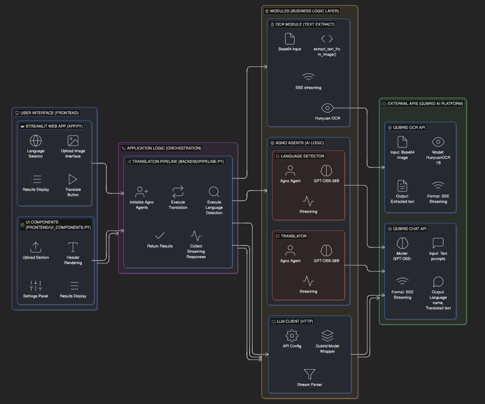
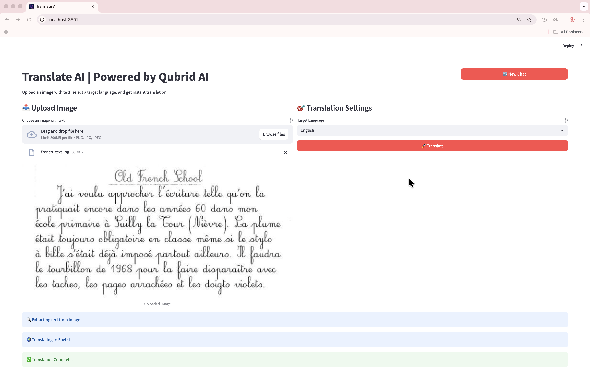
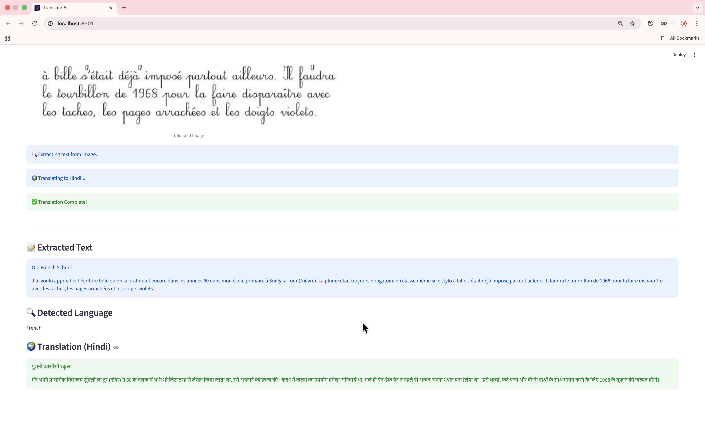

<div align="center">
  
</div>

> A production-ready OCR-based Language Translation application powered by Qubrid AI's Hunyuan OCR 1B and GPT-OSS-20B models

[](https://www.python.org/downloads/)
[](https://streamlit.io)
[](https://agno.dev)

# Translate AI

A production-grade, vision-powered language translation platform built with **Qubrid AI**, **Agno Framework**, and **Streamlit**. This application specializes in extracting text from images through advanced OCR and translating it to 48+ languages using intelligent AI agents.

---

## Problem Statement

Language barriers in visual content present significant challenges across various domains:
- **Travel & Tourism**: Tourists struggle to read foreign signs, menus, and documents
- **Education**: Students need to translate textbook images and handwritten notes
- **Business**: Companies require quick translation of product labels and documents
- **Accessibility**: Non-native speakers face difficulties understanding visual information

Traditional translation workflows are cumbersome:
- Manual text retyping from images is time-consuming and error-prone
- Separate OCR and translation tools create friction in the workflow
- Most solutions lack intelligent language detection
- Poor handling of multilingual or low-quality images

## Solution Overview

To solve this problem, I built a **OCR–Powered Language Translation Platform** that intelligently processes images and delivers accurate translations through a streamlined workflow.

### 1. Vision-Based Text Extraction
Instead of requiring manual text input, the system leverages **Hunyuan OCR 1B**, which is capable of:
- Extracting text directly from images (photos, screenshots, documents)
- Handling various image qualities and formats
- Processing multiple languages and scripts
- Maintaining text structure and formatting

The OCR model processes uploaded images and extracts all readable text, enabling seamless translation without manual transcription.

### 2. Intelligent Language Detection
The system uses an **Agno-powered Language Detection Agent** with GPT-OSS-20B to:
- Automatically identify the source language from extracted text
- Handle multilingual content intelligently
- Provide confidence in language identification
- Support 48+ languages across multiple scripts

This eliminates the need for users to manually specify the source language, streamlining the workflow.

### 3. Agent-Based Translation Pipeline
The translation workflow is orchestrated through **Agno agents**, providing:
- **Streaming responses** for real-time feedback
- **Modular architecture** with separate detection and translation agents
- **Robust error handling** with graceful fallbacks
- **Debug mode** for transparency in AI decision-making

The **Translation Agent** powered by GPT-OSS-20B delivers:
- Context-aware translations preserving meaning and tone
- Support for 48 target languages
- High-quality output for various text types

### 4. Stateless, User-Friendly Design
The application features:
- **Clean UI** with intuitive upload and selection interfaces
- **Real-time processing** with progress indicators
- **Immediate results** showing extracted text, detected language, and translation
- **No persistence overhead** - each translation is independent

## Key Outcomes
- Successfully extracts and translates text from images in a single workflow
- Supports 48+ languages with intelligent auto-detection
- Provides real-time streaming responses for better UX
- Eliminates manual text transcription and language selection
- Built on production-ready Agno framework with Qubrid AI models

---

## ⚙️ Installation & Setup

1.  **Clone the repository**:
    ```bash
    git clone https://github.com/kannan-qubrid/Translate-AI.git
    cd Translate-AI
    ```

2.  **Install dependencies**:
    ```bash
    uv sync
    ```

3.  **Configure Environment**:
    Create a `.env` file with your `QUBRID_API_KEY`

    You can create your Qubrid API Key from this link: [https://platform.qubrid.com](https://platform.qubrid.com)

    ```bash
    QUBRID_API_KEY=<YOUR_QUBRID_API_KEY>
    QUBRID_OCR_URL=https://platform.qubrid.com/api/v1/qubridai/ocr/chat
    QUBRID_CHAT_URL=https://platform.qubrid.com/api/v1/qubridai/chat/completions
    ```

4.  **Run the application**:
    ```bash
    uv run streamlit run app.py
    ```

---

## 📂 Project Structure

```bash
Translate-AI/
├── app.py                          # Main Streamlit application
├── backend/
│   ├── agents/
│   │   ├── __init__.py
│   │   ├── language_detector.py    # Agno agent for language detection
│   │   └── translator.py           # Agno agent for translation
│   ├── llm/
│   │   ├── __init__.py
│   │   ├── agno_qubrid_model.py    # Custom Agno model wrapper for Qubrid
│   │   └── qubrid_client.py        # Low-level Qubrid API client
│   ├── ocr/
│   │   ├── __init__.py
│   │   └── ocr.py                  # OCR text extraction (Hunyuan OCR)
│   ├── pipeline.py                 # Translation pipeline orchestration
│   └── utils.py                    # Utility functions
├── frontend/
│   ├── assets/
│   │   ├── qubrid_logo.png         # Qubrid branding logo
│   │   ├── qubrid_banner.png       # Banner image
│   │   ├── Architecture.png        # Architecture diagram
│   │   ├── home_page.png           # Home page screenshot
│   │   ├── UI_translated_to_english.png  # Translation result (English)
│   │   └── UI_translated_to_hindi.png    # Translation result (Hindi)
│   └── ui_components.py            # Reusable UI rendering functions
├── .env                            # Environment variables (API keys)
├── pyproject.toml                  # Project dependencies
└── README.md                       # Project documentation
```

---

## 🏗️ System Architecture

The following diagram illustrates the project's 4-layer modular architecture, ensuring scalability, maintainability, and clear separation of concerns.



### 🧩 Architectural Layers

#### **Layer 1: User Interface (Frontend)**
*Built with Streamlit, providing a clean and intuitive experience.*
*   **Header Section**: Displays project title and subtitle with Qubrid AI branding.
*   **Upload Interface**: Drag-and-drop image upload with preview functionality.
*   **Translation Settings**: Language selector dropdown with 48 supported languages.
*   **Results Display**: Shows extracted text, detected language, and translated output.

#### **Layer 2: Application Logic (Orchestration)**
*The coordination layer that manages workflow and state.*
*   **Main Application (`app.py`)**: Handles page configuration, routing, and workflow orchestration.
*   **Translation Pipeline**: Coordinates the 2-step translation workflow (detection → translation).
*   **Response Collection**: Manages streaming responses from Agno agents.

#### **Layer 3: Modules (Core Backend)**
*The engine of the application, responsible for processing and intelligence.*
*   **Agno Agents Module (`agents/`)**: Houses the Language Detection and Translation agents.
*   **OCR Module (`ocr/`)**: Handles text extraction from images using Hunyuan OCR 1B.
*   **LLM Module (`llm/`)**: Contains the Qubrid model wrapper and API client.
*   **Pipeline Module (`pipeline.py`)**: Orchestrates the complete translation workflow.

#### **Layer 4: External APIs (AI Intelligence)**
*The foundational intelligence layer powered by Qubrid AI.*
*   **Qubrid AI Platform**: Hosts the production-grade AI infrastructure.
*   **Models Used**:
    - `Hunyuan OCR 1B` — Advanced OCR for text extraction
    - `GPT-OSS-20B` — Language detection and translation

---

## 📸 UI Screenshots

### Home Page

*Clean landing page with upload interface and language selector.*

### Translation Result (English)

*Complete translation workflow showing extracted text, detected language, and English translation.*

### Translation Result (Hindi)

*Translation output in Hindi demonstrating multi-language support.*

---

## 🚀 Key Features

### 🔍 2-Step Translation Pipeline
The core of the application is a robust backend pipeline:
1.  **OCR Text Extraction**: Uses Hunyuan OCR 1B to extract text from uploaded images.
2.  **Language Detection**: Agno agent identifies the source language automatically.
3.  **Translation**: Agno agent translates text to the selected target language.

### 🌍 48+ Language Support
Comprehensive language coverage including:
- **European**: English, Spanish, French, German, Italian, Portuguese, Dutch, Polish, Swedish, Norwegian, Danish, Finnish, Greek, Czech, Romanian, Hungarian, Ukrainian, Bulgarian, Serbian, Croatian, Slovak, Slovenian, Lithuanian, Latvian, Estonian, Icelandic, Irish, Welsh, Catalan, Basque, Galician
- **Asian**: Chinese (Simplified), Chinese (Traditional), Japanese, Korean, Hindi, Bengali, Thai, Vietnamese, Indonesian, Malay, Filipino
- **Middle Eastern**: Arabic, Hebrew, Turkish
- **African**: Swahili, Zulu

### 🤖 Agno-Powered Intelligence
- **Streaming Responses**: Real-time feedback during processing
- **Debug Mode**: Transparent AI execution logs
- **Modular Agents**: Separate agents for detection and translation
- **Error Handling**: Graceful fallbacks and error messages

### 🎨 Clean User Experience
- **Simple Workflow**: Upload → Select → Translate
- **Instant Results**: No waiting, immediate display of results
- **Visual Feedback**: Progress indicators and status messages
- **Responsive Design**: Works across different screen sizes

---

## 🔗 Official Resources

-   **Qubrid Official Cookbooks**: [Explore on GitHub](https://github.com/QubridAI-Inc/qubrid-cookbook)
-   **Qubrid YouTube Channel**: [Watch Tutorials](https://www.youtube.com/watch?v=1LX-w2Sgvts&list=PLoaE-lmLecgPoYuSa2BsmlJ8isKB5KFtq)

---

<div align="center">

Made with ❤️ by Qubrid AI

⭐ Star this repository if you find it helpful!

</div>
